# Object Detection

## Object Detection이란?

- 이미지나 동영상에서 사람, 동물, 차량 등 의미 있는 객체(object)의 종류와 그 위치(bounding box)를 정확하게 찾기 위한 컴퓨터 비전 기술.

- 영상에서 관심 대상을 인식하기 위해 일반적으로 검출 대상에 대한 후보 영역을 찾고 그 후보 영역에 대한 객체의 종류와 위치를 학습된 모델을 통해 예측한다. 이 과정을 위해서 영상 및 영상 내의 객체 종류(class)와 객체 위치(bounding box) 정보가 필요하다. 얼굴, 도로상의 보행자 및 차량 등의 인식에 딥 러닝(deep learning) 기반의 객체 탐지 기술이 많이 이용된다.

출처: 네이버 지식백과, 객체 탐지[object detection, 客體探知] (IT용어사전, 한국정보통신기술협회)


## Object Detection의 순서도

- 영상이나 이미지가 들어오면 한 부분에 물체가 있다는걸 인식 (Object Recognition)하고, 그 물체가 무엇인지 분류(Object Classification)하고 정확한 위치를 찍어줌(Object Localization). 

- Object Classification와 Object Localization를 합쳐서 Object Detection이라고 부름.

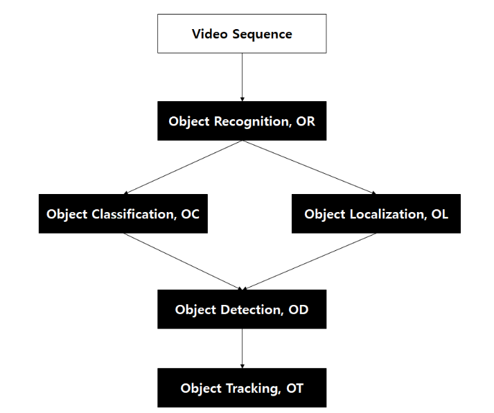


- Object Recognition과 Object Detection에 대하여 그 의미가 혼용되거나 다르게 사용되는 경우도 존재함

- 대부분은 Object Classification와 Object Localization를 합쳐서 Object Detection이라고 부름


## Object Detection의 역사

- 2012년 이전, '영상처리'로만 해결했었음

- 그 이후, 컴퓨팅파워가 발전하고 인터넷에 많은 데이터가 쌓이면서 딥러닝이 활용되기 시작함

- Two-shot-detection(초기 버전)

  - 영상이나 이미지 전체를 Sliding하면서 계속 네트워크를 돌려줌
  - 한장의 이미지에 엄청나게 많은 연산량이 필요함
  - 실시간성 zero

- Two-shot-detection (업그레이드 버전)

  

  - 이미지 전체에 대해서가 아니라 물체가 있을 것이라고 생각되는 부분들만 box 형태로 잘라냄
  - 그 결과들에 대해서 CNN 사용
  - ex) R-CNN, F-CNN, R-FCN, FPN-FRCN, Fast R-CNN

- One-shot-detection

  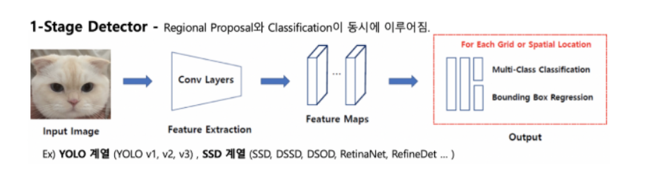

  - 하나의 신경망을 통과하여 물체의 bounding box와 class를 동시에 예측하게 됨
  - ex) YOLO, SSD, RetinaNet


## One-shot-detection vs Two-shot-detection?

- One-shot-detection
  - 장점: 높은 실시간성
  - 단점: Two-shot-detection보다 상대적으로 정확도가 떨어짐
- Two-shot-detection
  - 장점: 높은 정확도
  - 단점: 느린 속도
- 현재는 두개의 알고리즘 모두 계속 개발 되어 가고 있음


출처: https://mickael-k.tistory.com/24


## 'LET IT GO'에서의 Object Detection

- 1단계: 컨베이어 벨트에 올려진 레고들의 위치를 인식하고 적절한 크기로 잘라내는 과정 
  - 'Object Detection의 순서도'에서 Object Recognition과 Object Localization를 동시에 처리한다고 볼 수있음
- 2단계: 그 결과를 통해 학습된 CNN 모델로 레고를 분류(Object Classification)

- Two-shot-detection을 사용한다고 할 수 있음


## 1단계: Object Recognition + Object Localization

```python
import cv2
import numpy as np
import os
from matplotlib import pyplot as plt

# 이미지를 보여주기 위한 함수
def previewImg(text,img_preview,grayscale=False):
    if grayscale==False:
        # BGR을 RGB로 변환
        plt.imshow(cv2.cvtColor(img_preview, cv2.COLOR_BGR2RGB))
    else:
        # GRAY를 RGB로 변환
        plt.imshow(cv2.cvtColor(img_preview, cv2.COLOR_GRAY2RGB))
    plt.title(text)
    plt.show()

# 레고 이미지 리스트 불러오기
lego_images = os.listdir('gdrive/My Drive/Colab Notebooks/input/red3')

# 배경 이미지 불러오기
img_bg=cv2.imread('gdrive/My Drive/Colab Notebooks/input/various_bg.jpg')

# 각각의 레고 이미지에 대하여 다음의 코드 실행
for index in range(len(lego_images)):
  # 레고 이미지 불러오기
  img_example=cv2.imread('gdrive/My Drive/Colab Notebooks/input/red3/{}'.format(lego_images[index]))
	
  # 레고 이미지와 배경 이미지를 b, g, r로 나눠줌
  example_b, example_g, example_r = cv2.split(img_example)
  back_b, back_g, back_r = cv2.split(img_bg)

  # b, g, r 각각에 대하여 차이의 절대값을 구함
  diff_b=cv2.absdiff(back_b,example_b)
  diff_g=cv2.absdiff(back_g,example_g)
  diff_r=cv2.absdiff(back_r,example_r)

  # 차이가 임계치를 넘어가는 부분과 아닌 부분을 이분화해줌(전처리 과정)
  ret_b, img_tresh_b = cv2.threshold(diff_b, 100, 255,cv2.THRESH_BINARY)
  ret_g, img_tresh_g = cv2.threshold(diff_g, 100, 255,cv2.THRESH_BINARY)
  ret_r, img_tresh_r = cv2.threshold(diff_r, 100, 255,cv2.THRESH_BINARY)
  img_tresh_all = img_tresh_b + img_tresh_g + img_tresh_r
  diff_gray_blur = cv2.GaussianBlur(img_tresh_all,(5,5),0)
  ret, img_tresh = cv2.threshold(diff_gray_blur, 0,255,cv2.THRESH_BINARY+cv2.THRESH_OTSU)

  # contour 찾기
  arr_cnt, a2 = cv2.findContours(img_tresh, cv2.RETR_EXTERNAL,cv2.CHAIN_APPROX_SIMPLE)

  # 원본 이미지를 복사 후, contour 그려줌
  img_with_allcontours=img_example.copy()
  cv2.drawContours(img_with_allcontours, arr_cnt, -1, (0,255,0), 3)

  # !!! It may be possible that various contours are showing at this stage, we'll solve that below.
  
  # Just in case, we need to make sure we 'weed out' any contour noise that might generate as images have variations.

  # get the dimensions of the image
  height, width, channels = img_example.shape

  # shorten the variable names
  w=width
  h=height

  validcontours=[]
  contour_index=-1

  # iterate through each contour found
  for i in arr_cnt:

      contour_index=contour_index+1
      ca=cv2.contourArea(i)

      # Calculate W/H Ratio of image
      x,y,w,h = cv2.boundingRect(i)
      aspect_ratio = float(w)/h

      # Flag as edge_noise if the object is at a Corner
      # Contours at the edges of the image are most likely not valid contours
      edge_noise=False
      # if contour starts at x=0 then it's on th edge
      if x==0:
          edge_noise=True
      if y==0:
          edge_noise=True
      # if the contour x value + its contour width exceeds image width, it is on an edge
      if (x+w)==width:
          edge_noise=True
      if (y+h)==height:
          edge_noise=True
              
      # DISCARD noise with measure by area (1x1 round plate dimensions is 1300)
      # if by any chance a contour is drawn on one pixel, this catches it.
      if ca>1300:

          # DISCARD as noise if W/H ratio > 7 to 1 (1x6 plate is 700px to 100px)
          # the conveyor belt has a join line that sometimes is detected as a contour, this ignores it based on w/h ratio
          if aspect_ratio<=6:
              
              # DISCARD if at the Edge
              if edge_noise==False:
                  validcontours.append(contour_index)

  # copy the original picture
  img_withcontours=img_example.copy()
                  
  # call out if more than 1 valid contour is found
  if len(validcontours)>1:
      print("There is more than 1 object in the picture")
  else:
      if len(validcontours)==1:
          print("One object detected")
      else:
          print("No objects detected")
          # FYI: code below will most likely error out as it tries to iterate on an array
      
  # it might be possible we have more than 1 validcontour, iterating through them here
  # if there is zero contours, this most likely will error out
  print('{}번째 레고'.format(index))
  print(validcontours)
  print("===================================================================")
  for k in range(len(validcontours)):
      cv2.drawContours(img_withcontours, arr_cnt,validcontours[k], (0,255,0), 3)
    
  # validcontours에서 정상적인 위치의 레고만 추려내기 위한 코드 
  img_withrectangle=img_example.copy()
  add = 40
  limit = 100
  object_position = []
  for j in validcontours:
      x,y,w,h = cv2.boundingRect(arr_cnt[j])
      c_x = x + int(w//2)
      c_y = y + int(h//2)
      n_w = int(w//2)+add
      n_h = int(h//2)+add
      if c_x + n_w < width - limit and c_y + n_h < height - limit and 0 + limit <= c_x - n_w and 0 + limit <= c_y - n_h: 
        if w > h:
            cv2.rectangle(img_withrectangle,(c_x-n_w, c_y-n_w),(c_x+n_w, c_y+n_w),(0,255,0),2)
            object_position.append((c_x-n_w, c_y-n_w, c_x+n_w, c_y+n_w))
        else:
            cv2.rectangle(img_withrectangle,(c_x-n_h, c_y-n_h),(c_x+n_h, c_y+n_h),(0,255,0),2)
            object_position.append((c_x-n_h, c_y-n_h, c_x+n_h, c_y+n_h))

  selected_lego = []
  max_length = 0
  for p in object_position:
      try:
        if p[3] - p[1] > max_length:
          selected_lego = p
      except:
        continue
  if selected_lego != []:
    previewImg('selected_lego',img_example[selected_lego[1]:selected_lego[3], selected_lego[0]:selected_lego[2]])
    
```


### 결과

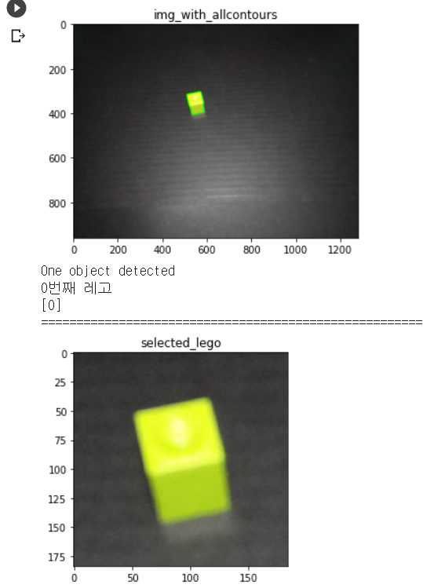

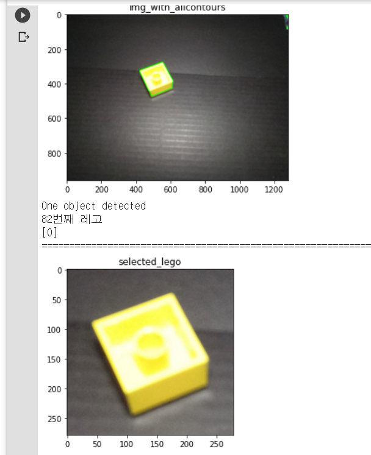

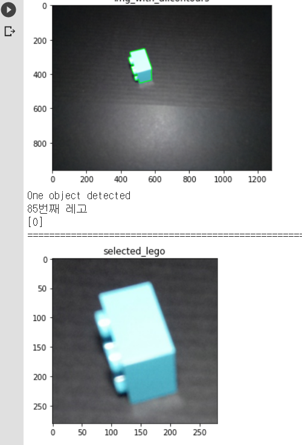

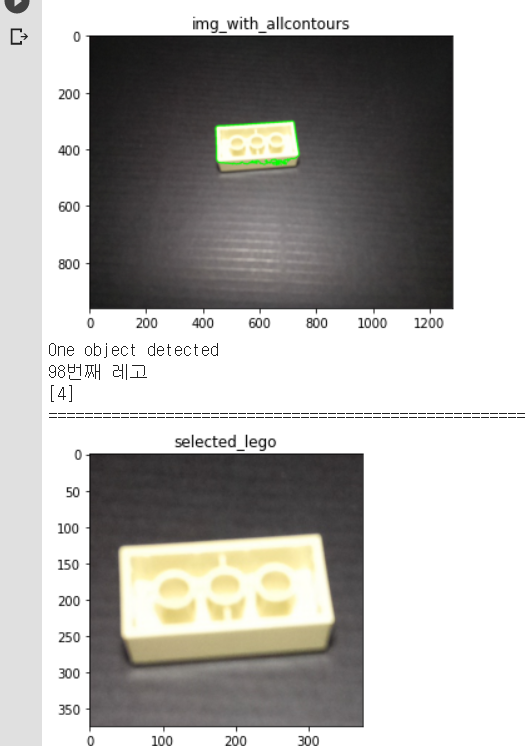

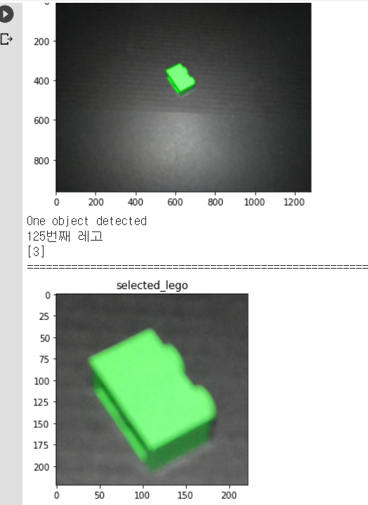

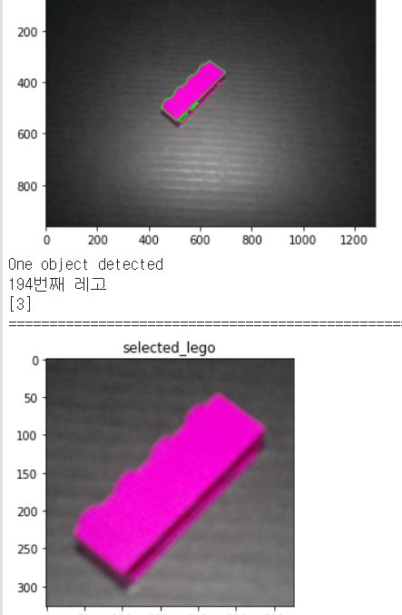

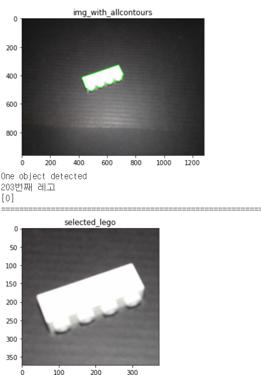

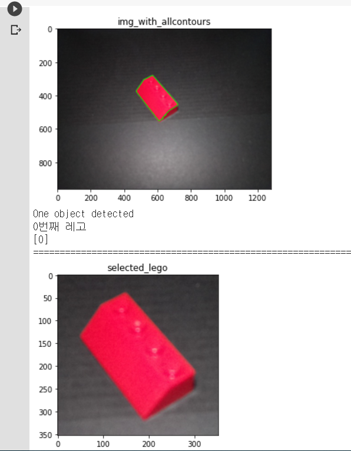

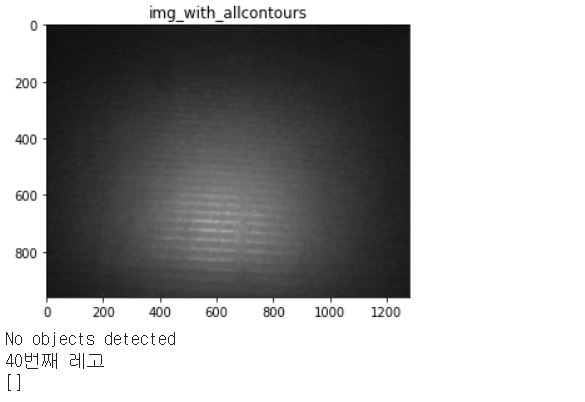


### 결과 해석

대부분의 색깔과 모양을 인식하고 레고가 없는 경우도 인식함

하지만, 배경과의 차이를 인식하여 결과를 내기 때문에 배경에 영향을 많이 받음

(Issue - 1)

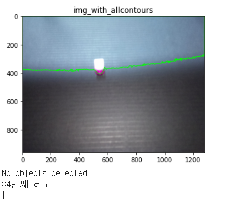

다음과 같이 배경이 달라질 경우, 제대로 결과를 내지 못함

-> 일정한 배경을 유지할 수 있도록 환경을 만들어 주어야함(일정한 빛, 밝기, 깔끔한 배경 등)

(Issue - 2)

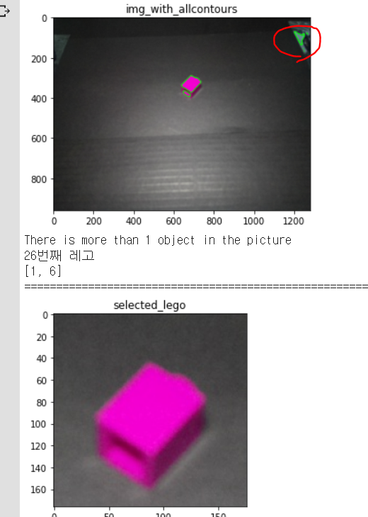

-> 이미지에서 모서리쪽에 있는 객체는 제외하여 인식하도록 하였기 때문에 결과는 제대로 내지만 최대한 배경에 데미지가 없도록 하는 것이 좋음

(Issue - 3)

배경과의 차이로 인식을 하기 때문에 검은색 배경을 사용했을 경우, 밝기가 어두운(검은색에 가까운 )레고들은 인식하기 어렵다는 점이 있음

-> 배경을 흰색과 검은색 두개를 사용하여 해결할 수 있음


## 2단계: Object Classification

```python
import tensorflow.keras.layers as Layers
import tensorflow.keras.activations as Actications
import tensorflow.keras.models as Models
import tensorflow.keras.optimizers as Optimizer
import tensorflow.keras.metrics as Metrics
import tensorflow.keras.utils as Utils
from keras.utils.vis_utils import model_to_dot
import os
import matplotlib.pyplot as plot
import cv2
import numpy as np
from sklearn.utils import shuffle
from sklearn.metrics import confusion_matrix as CM
from random import randint
from IPython.display import SVG
import matplotlib.gridspec as gridspec

def get_images(directory):
    Images = []
    Labels = []  # 0 for Building , 1 for forest, 2 for glacier, 3 for mountain, 4 for Sea , 5 for Street
    label = 0
    for labels in os.listdir(directory): #Main Directory where each class label is present as folder name.
        if labels == '1x1': #Folder contain Glacier Images get the '2' class label.
            label = 0
        elif labels == '1x2':
            label = 1
        elif labels == '2x2':
            label = 2
        elif labels == '2x3':
            label = 3
        elif labels == '2x4':
            label = 4
        elif labels == '2x4L':
            label = 5
        print(len(os.listdir(directory+labels)))
        for image_file in os.listdir(directory+labels): #Extracting the file name of the image from Class Label folder
            image = cv2.imread(directory+labels+r'/'+image_file) #Reading the image (OpenCV)
            image = cv2.resize(image,(150,150)) #Resize the image, Some images are different sizes. (Resizing is very Important)
            Images.append(image)
            Labels.append(label)
    
    return shuffle(Images,Labels,random_state=817328462) #Shuffle the dataset you just prepared.

def get_classlabel(class_code):
    labels = {2:'2x2', 4:'2x4', 0:'1x1', 1:'1x2', 5:'2x4L', 3:'2x3'}
    
    return labels[class_code]

# print(os.listdir('My Drive/imageprocessing1/input/seg_train/seg_train/forest/'))
Images, Labels = get_images('My Drive/imageprocessing2/input/seg_train/seg_train/') #Extract the training images from the folders.
print(len(Images))

Images = np.array(Images) #converting the list of images to numpy array.
Labels = np.array(Labels)
print("Shape of Images:",Images.shape)
print("Shape of Labels:",Labels.shape)
f,ax = plot.subplots(5,5) 
f.subplots_adjust(0,0,3,3)
for i in range(0,5,1):
    for j in range(0,5,1):
        rnd_number = randint(0,len(Images))
        ax[i,j].imshow(Images[rnd_number])
        ax[i,j].set_title(get_classlabel(Labels[rnd_number]))
        ax[i,j].axis('off')
model = Models.Sequential()


# 첫번째로 넣을때 input_shape를 입력해줘야한다. 그 이후로는 이전레이어에서 나오는 것들로 추론 가능하다.
model.add(Layers.Conv2D(200,kernel_size=(3,3),activation='relu',input_shape=(150,150,3)))
# 148, 148, 200.. 가로세로 148, 200장의 이미지 출력

model.add(Layers.Conv2D(180,kernel_size=(3,3),activation='relu'))
# 146, 146, 180

model.add(Layers.MaxPool2D(5,5))
# 29, 29, 180.. 이전 레이어에서 5*5당 한칸씩 추출함

model.add(Layers.Conv2D(180,kernel_size=(3,3),activation='relu'))
# 27, 27, 180

model.add(Layers.Conv2D(140,kernel_size=(3,3),activation='relu'))
# 25, 25, 140

model.add(Layers.Conv2D(100,kernel_size=(3,3),activation='relu'))
# 23, 23 100

model.add(Layers.Conv2D(50,kernel_size=(3,3),activation='relu'))
# 21, 21 50

model.add(Layers.MaxPool2D(5,5))
# 4, 4, 50

model.add(Layers.Flatten())
# 800... 4*4*50을 해서 여러개의 채널을 하나의 벡터화

model.add(Layers.Dense(180,activation='relu'))
# 180.. 800을 180으로 압축함

model.add(Layers.Dense(100,activation='relu'))
# 100

model.add(Layers.Dense(50,activation='relu'))
# 50

model.add(Layers.Dropout(rate=0.5))
# 과적합 방지 레이어 0이 아닌 모든 입력은 1/(1-rate)씩 스케일됨. 0.5면 2, 0.9면 10배

model.add(Layers.Dense(6,activation='softmax'))


model.compile(optimizer=Optimizer.Adam(lr=0.0001),loss='sparse_categorical_crossentropy',metrics=['accuracy'])

model.summary()

trained = model.fit(Images,Labels,epochs=35,validation_split=0.30)

plot.plot(trained.history['accuracy'])
plot.plot(trained.history['val_accuracy'])
plot.title('Model accuracy')
plot.ylabel('Accuracy')
plot.xlabel('Epoch')
plot.legend(['Train', 'Test'], loc='upper left')
plot.show()

plot.plot(trained.history['loss'])
plot.plot(trained.history['val_loss'])
plot.title('Model loss')
plot.ylabel('Loss')
plot.xlabel('Epoch')
plot.legend(['Train', 'Test'], loc='upper left')
plot.show()
test_images,test_labels = get_images('My Drive/imageprocessing2/input/seg_test/seg_test/')
test_images = np.array(test_images)
test_labels = np.array(test_labels)
model.evaluate(test_images,test_labels, verbose=1)
pred_images,no_labels = get_images('My Drive/imageprocessing2/input/seg_pred/')
pred_images = np.array(pred_images)
pred_images.shape
fig = plot.figure(figsize=(30, 30))
outer = gridspec.GridSpec(5, 5, wspace=0.2, hspace=0.2)


model.save('/My Drive/imageprocessing2/my_model')

import tensorflow as tf2
model2 = tf2.keras.models.load_model('/My Drive/imageprocessing2/my_model')

for i in range(25):
    inner = gridspec.GridSpecFromSubplotSpec(2, 1,subplot_spec=outer[i], wspace=0.1, hspace=0.1)
    rnd_number = randint(0,len(pred_images))
    pred_image = np.array([pred_images[rnd_number]])
    pred_class = get_classlabel(model2.predict_classes(pred_image)[0])
    pred_prob = model2.predict(pred_image).reshape(6)
    print(pred_class)
    print(pred_prob)
    plot.imshow(pred_image[0])
    plot.show()
    for j in range(2):
        if (j%2) == 0:
            ax = plot.Subplot(fig, inner[j])
            ax.imshow(pred_image[0])
            ax.set_title(pred_class)
            ax.set_xticks([])
            ax.set_yticks([])
            fig.add_subplot(ax)
        else:
            ax = plot.Subplot(fig, inner[j])
            ax.bar([0,1,2,3,4,5],pred_prob)
            fig.add_subplot(ax)


fig.show()
```


### 결과

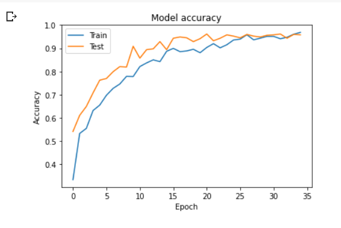

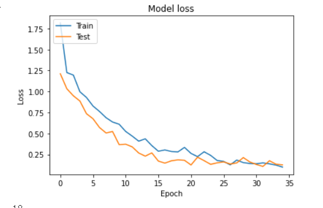

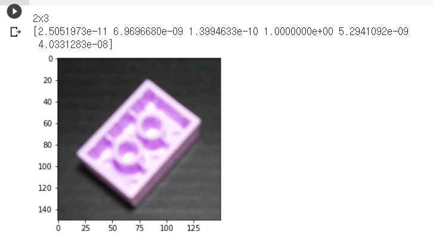

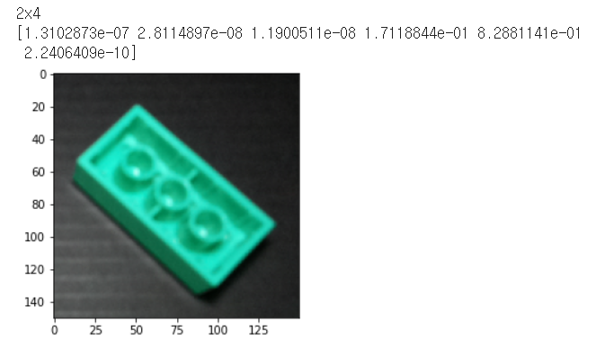

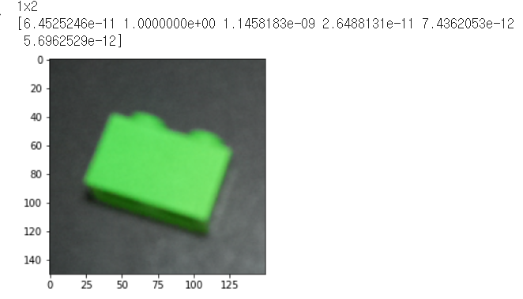

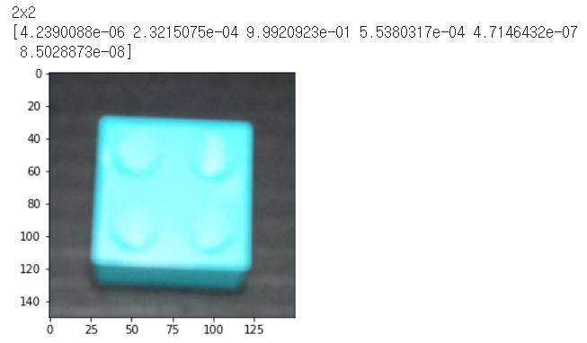

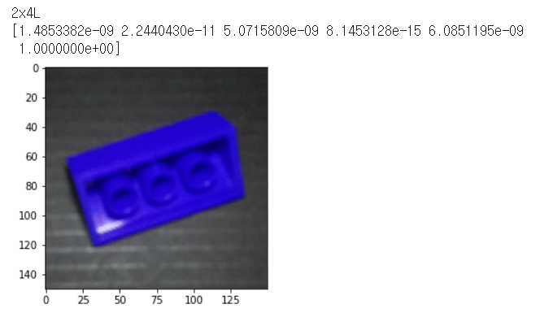

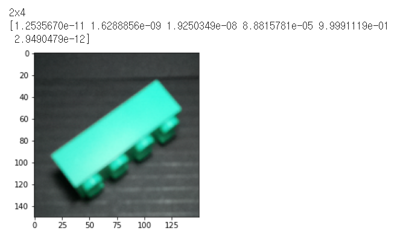

