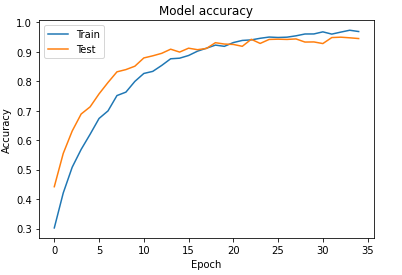
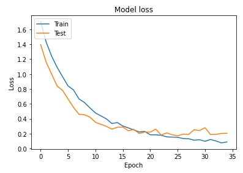

# Object Recognition

## Object Recognition이란?

Object Recognition은 이미지 또는 비디오 상의 객체를 식별하는 컴퓨터 비전 기술입니다. 객체 인식은 딥러닝과 머신 러닝 알고리즘을 통해 산출되는 핵심 기술입니다. 사람은 사진 또는 비디오를 볼 때 인물, 물체, 장면 및 시각적 세부 사항을 쉽게 알아챌 수 있습니다. 이 기술의 목표는 이미지에 포함된 사항을 이해하는 수준의 능력과 같이 사람이라면 당연히 할 수 있는 일을 컴퓨터도 할 수 있도록 학습시키는 것입니다.

출처: mathworks(https://kr.mathworks.com/solutions/image-video-processing/object-recognition.html)

## 레고 분류기에서의 Object Recognition

Object Recognition은 자율주행과 같은 컴퓨터 비전 시스템에 사용되지만 이 프로젝트에서는 레고 분류기로 사용하였기에 레고 분류기에서 Object Recognition이 어떻게 수행되는지에 대해서 알아보겠습니다.

우선 필요한 모듈들을 불러옵니다.

```python
import tensorflow.keras.layers as Layers
import tensorflow.keras.activations as Actications
import tensorflow.keras.models as Models
import tensorflow.keras.optimizers as Optimizer
import tensorflow.keras.metrics as Metrics
import tensorflow.keras.utils as Utils
from keras.utils.vis_utils import model_to_dot
import os
import matplotlib.pyplot as plot
import cv2
import numpy as np
from sklearn.utils import shuffle
from sklearn.metrics import confusion_matrix as CM
from random import randint
from IPython.display import SVG
import matplotlib.gridspec as gridspec
```

이미지를 불러오는 함수를 정의합니다.

```python
def get_images(directory):
    Images = []
    Labels = []  # {1x1: 0, '1x2': 1, '2x2': 2, '2x3': 3, '2x4': 4, '2x4L': 5}
    label = 0
    for labels in os.listdir(directory): # 각 라벨별 디렉토리 리스트를 반환합니다.
        if labels == '1x1':
            label = 0
        elif labels == '1x2':
            label = 1
        elif labels == '2x2':
            label = 2
        elif labels == '2x3':
            label = 3
        elif labels == '2x4':
            label = 4
        elif labels == '2x4L':
            label = 5
        for image_file in os.listdir(directory+labels): # 각 디렉토리별로 존재하는 파일 리스트를 반환합니다.
            image = cv2.imread(directory+labels+r'/'+image_file) # OpenCV를 이용하여 각 각의 이미지를 읽어옵니다.
            image = cv2.resize(image,(150,150)) # 이미지를 keras model에 입력으로 사용할 수 있도록 리사이즈합니다.
            Images.append(image)
            Labels.append(label)
    
    return shuffle(Images,Labels,random_state=817328462) # 데이터셋의 순서를 랜덤하게 섞어줍니다.
```

결과로 나온 클래스 번호를 라벨 값으로 변환하는 함수를 정의합니다.

```python
def get_classlabel(class_code):
    labels = {0:'1x1', 1:'1x2', 2:'2x2', 3:'2x3', 4:'2x4', 5:'2x4L'}
    
    return labels[class_code]
```

get_images 함수를 실행합니다.

```python
Images, Labels = get_images('My Drive/imageprocessing3/input/seg_train/seg_train/')
```

keras 모델을 정의합니다.

```python
model = Models.Sequential()

# 첫번째로 넣을때 input_shape를 입력해줘야한다. 그 이후로는 이전레이어에서 나오는 것들로 추론 가능하다.
model.add(Layers.Conv2D(200,kernel_size=(3,3),activation='relu',input_shape=(150,150,3)))
# 148, 148, 200.. 가로세로 148, 200장의 이미지 출력
model.add(Layers.Conv2D(180,kernel_size=(3,3),activation='relu'))
# 146, 146, 180
model.add(Layers.MaxPool2D(5,5))
# 29, 29, 180.. 이전 레이어에서 5*5당 한칸씩 추출함
model.add(Layers.Conv2D(180,kernel_size=(3,3),activation='relu'))
# 27, 27, 180
model.add(Layers.Conv2D(140,kernel_size=(3,3),activation='relu'))
# 25, 25, 140
model.add(Layers.Conv2D(100,kernel_size=(3,3),activation='relu'))
# 23, 23 100
model.add(Layers.Conv2D(50,kernel_size=(3,3),activation='relu'))
# 21, 21 50
model.add(Layers.MaxPool2D(5,5))
# 4, 4, 50
model.add(Layers.Flatten())
# 800... 4*4*50을 해서 여러개의 채널을 하나의 벡터화
model.add(Layers.Dense(180,activation='relu'))
# 180.. 800을 180으로 압축함
model.add(Layers.Dense(100,activation='relu'))
# 100
model.add(Layers.Dense(50,activation='relu'))
# 50
model.add(Layers.Dropout(rate=0.5))
# 과적합 방지 레이어 0이 아닌 모든 입력은 1/(1-rate)씩 스케일됨. 0.5면 2, 0.9면 10배
model.add(Layers.Dense(6,activation='softmax'))
# 모델을 컴파일
model.compile(optimizer=Optimizer.Adam(lr=0.0001),loss='sparse_categorical_crossentropy',metrics=['accuracy'])
```

정의한 모델을 학습시키고 결과를 시각화합니다..

```python
trained = model.fit(Images,Labels,epochs=35,validation_split=0.30)
plot.plot(trained.history['accuracy'])
plot.plot(trained.history['val_accuracy'])
plot.title('Model accuracy')
plot.ylabel('Accuracy')
plot.xlabel('Epoch')
plot.legend(['Train', 'Test'], loc='upper left')
plot.show()
```



```python
plot.plot(trained.history['loss'])
plot.plot(trained.history['val_loss'])
plot.title('Model loss')
plot.ylabel('Loss')
plot.xlabel('Epoch')
plot.legend(['Train', 'Test'], loc='upper left')
plot.show()
test_images,test_labels = get_images('My Drive/imageprocessing2/input/seg_test/seg_test/')
test_images = np.array(test_images)
test_labels = np.array(test_labels)
model.evaluate(test_images,test_labels, verbose=1)
```



학습시킨 모델을 저장합니다.

```python
model.save('/My Drive/imageprocessing2/my_model.h5')
```

학습시킨 모델을 불러오려면 다음과 같이 입력합니다.

```python
import tensorflow as tf2
model = tf2.keras.models.load_model('/My Drive/imageprocessing2/my_model.h5')
```

학습시킨 모델에 이미지를 입력하여 결과를 받아보려면 다음과 같이 입력합니다.

```python
current_class_code = model.predict_classes(image)[0]
current_class_label = get_classlabel(current_class_code)
```

학습은 구글의 colab를 이용하고 라즈베리파이에서는 이렇게 학습된 모델을 읽어와서 결과값을 추정합니다.

이렇게 추정된 결과를 바탕으로 서버에 요청을 보내면 유저의 임시 인벤토리에 해당 부품의 정보가 등록이 되게 됩니다.