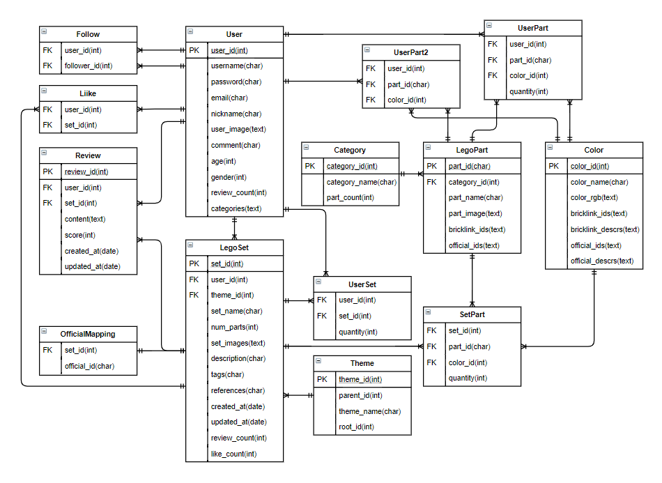

# Let It Go

## 서비스 개요

Let It Go는 사용자의 레고 보유 현황을 관리하고 다른 사용자들과 설계도를 공유하며 소통할 수 있는 서비스입니다. 사용자 정보 및 설계도 정보를 기반으로 관심을 가질만한 설계도를 추천해 주는 기능을 가지고 있습니다.

유저 혹은 아이템 기반 추천의 경우 리뷰 데이터가 충분한 경우 knn 알고리즘을 적용해 예상 점수가 높은 순서로 설계도를 반환하며, 리뷰 데이터가 충분하지 않은 경우 k-means 알고리즘을 적용하여 유저 혹은 설계도가 속한 군을 추정하고 해당 군에서 점수가 높은 순서로 설계도를 반환합니다.

레고레일은 사용자가 레고레일에 로그인을 한 후 레고를 투입하면 이미지를 촬영하여 투입된 부품이 무엇인지 판별한 후 해당 사용자의 인벤토리에 등록합니다.

## 핵심 기능 및 기대 효과

- 다양한 레고 설계도를 서로 공유하며 소통할 수 있는 SNS기능(Web)
- 사용자가 관심을 가질만한 설계도를 보여주는 추천 시스템(Big Data)
- 레고레일 및 보유 부품 및 설계도를 바탕으로 내 레고를 관리하는 시스템(AI & IoT)

위와같은 기능을 바탕으로 레고에 관심을 가지는 사람들이 더욱 편리하게 레고를 관리하고 서로의 창작물을 공유할 수 있게 되어 시장이 활성화 될 것으로 기대합니다.

## API

[API](backend/api/RESTful_API.md) 보러가기

## 레고마스터(IoT & AI)

[Lego Master](IoT/lego_master.md) 보러가기

## 주요 사용자

- 레고 창작을 좋아하거나 관심을 가지는 사람들
- 만든 레고 모델을 자랑하고 싶은 사람들

## 개발 환경

### 사용 언어

- python 3.7.6
- nodeJS 13.5.0

### 주요 라이브러리

- npm 6.13.4
- Django 3.0.6
- djangorestframework 3.11.0
- axios 0.19.2
- vue 2.6.11
- vuex 3.1.3
- pandas 1.0.3 
- numpy 1.18.1
- tensorflow 1.14.0(라즈베리파이), 2.2.0(학습용 PC)
- Keras 2.3.1
- opencv-python 3.4.4.19

## ERD



## 서비스 개요도


## Getting Started

### 로컬 환경

- 프론트엔드

```bash
# frontend 디렉토리로 경로 이동
cd lego
# dependency 설치
npm install
# 테스트 서버 구동
npm run serve
```

- 백엔드

```bash
# backend 디렉토리로 경로 이동
cd backend
# 필요한 라이브러리 설치
pip install -r requirements.txt
# DB 초기화
python manage.py makemigrations
python manage.py migrate
python manage.py initialize
# 테스트 서버 구동
python manage.py runserver
```

### 배포 환경

- 프론트엔드

```bash
# frontend 디렉토리로 경로 이동
cd lego
# dependency 설치
npm install
# 배포 서버 빌드
npm run build
# static파일 위치 변경
cp -r dist /www/frontend
```

- 백엔드

```bash
# backend 디렉토리로 경로 이동
cd backend
# 필요한 라이브러리 설치
pip3 install -r requirements.txt
# DB 초기화
python manage.py makemigrations
python manage.py migrate
python manage.py initialize
# 정적 파일 생성
python3 manage.py collectstatic
# 백엔드 서버 구동
nohup uwsgi --http :8765 --chdir /home/ubuntu/repos/s02p31d108/backend/ --wsgi-file [my_project_directory]/backend/backend/wsgi.py &
```

- nginx

```nginx
server {
    listen				80;
    server_name			my_site_domain(example.com);
    return				301 https://$host$request_uri;
}
server {
    listen				443 default_server;
    server_name			my_site_domain(example.com);
    root				/www/frontend/;
    location / {
        try_files		$uri $uri/ /index.html;
        add_header		'Access-Control-Allow-Origin' '*' always;
    }
    ssl					on;
    ssl_certificate		/etc/letsencrypt/live/django/fullchain.pem;
    ssl_certificate_key	/etc/letsencrypt/live/django/privkey.pem;
 }
upstream django {
    server				localhost:8765;
}
server {
    listen 				8009 ssl;
    server_name			my_site_domain(example.com);
    charset utf-8;
    access_log			[my_project_directory]/backend/logs/access.log;
    error_log			[my_project_directory]/backend/logs/error.log;
    location = /favicon.ico { access_log off; log_not_found off; }
    error_page 497 301 =307 my_site_domain(https://example.com)$request_uri;
    location /static/ {
        alias [my_project_directory]/backend/.static_root/;
    }
    ssl                     on;
    ssl_certificate_key /etc/letsencrypt/live/django/privkey.pem;

    location / {
        proxy_pass			http://my_site_domain(example.com):8765;
        proxy_pass_header	Server;
        proxy_set_header	Host $http_host;
        proxy_redirect		off;
        proxy_set_header	X-Real-IP $remote_addr;
        proxy_set_header	X-Forwarded-Protocol $scheme;
    }
}
```

- IoT

```bash
cd IoT
python3 LegoRail.py
```

## Naming Convention

모델 클래스 명: 파스칼케이스

변수 네이밍 규칙:

- CSS : 스네이크케이스
- JS: 캐멀 케이스
- 그 외: 스네이크 케이스

디렉토리, 파일명: 파스칼케이스

## Git 관리

### Branch

브랜치 개요는 다음과 같습니다.

브랜치 네이밍 규칙은 스네이크 케이스를 사용합니다.

master

- develop
  - frontend
    - 기능 명(feature/navbar 등)
  - backend
    - 기능 명
  - bugfix
- hotfix

## 디렉토리 구조

### frontend (lego)

jsonData: 프로젝트에 사용된 데이터를 모아둔 디렉토리

public: 최상위 html 파일과 baseUrl으로 설정된 디렉토리

src: 프로젝트에 사용되는 모든 `vue`파일이 모여있는 디렉토리

- `App.vue` : 최상위 컴포넌트
- `main.js` : 최상위 컴포넌트를 최초 호출하는 JavaScript 파일
- views: 페이지 단위의 컴포넌트가 위치하는 디렉토리
  - Page: 실제 서비스에서 필요한 페이지가 위치함
  - base: Login, Register, NotFound와 같이 기본적인 페이지가 위치함
- components: 페이지 단위 컴포넌트에서 쓰이는 소규모 컴포넌트가 위치하는 디렉토리
  - Detail: `Detail.vue`에서 사용된 컴포넌트
  - Home: `Home.vue` 에서 사용된 컴포넌트
  - MyPage: `Mypage.vue`에서 사용된 컴포넌트
  - Search: `Search.vue`에서 사용된 컴포넌트
  - UserSetting: `UserSetting.vue`에서 사용된 컴포넌트
  - Write: `Write.vue`에서 사용된 컴포넌트
- api: Axios 통신에 필요한 api들을 모아둔 디렉토리
  - http.js - 기본 url 관리, API요청시 헤더 관리 파일
  - index.js - API 관리 파일
- store: Vuex 상태관리에 필요한 js파일을 모아둔 디렉토리
  - modules: 각 페이지 단위에서 필요한 Vuex 관리 파일을 모아둔 디렉토리
- router: Router 통신 설정 관련 파일
- plugins: Vue-CLI에서 사용된 라이브러리의 설정 관련된 디렉토리
- assets: 프로젝트에 사용된 이미지 등을 모아둔 디렉토리

### backend

- api: 앱 폴더로 프로젝트에 사용되는 앱에 대한 정보를 담고 있습니다.
  - management/commands: python manage.py 로 사용할 명령을 정의하고 모아두는 곳입니다.
  - migrations: 마이그레이션 정보가 담겨 있습니다.
- backend: 프로젝트 폴더로 프로젝트에 필요한 정보를 담고 있습니다.
  - templates: 이메일 인증을 위한 페이지 html 파일들이 모여 있습니다.
- crawling: 데이터를 수집하기 위한 파일들을 모아둔 곳입니다.
  - data: DB 초기화에 사용될 정보가 담겨 있는 폴더입니다.
- data: 학습된 모델 데이터를 모아 둔 경로입니다.
- data_generator: 서비스에 필요한 더미 데이터를 생성하는 파일들을 모아둔 곳입니다.
- recommendation: 서버에 적용할 알고리즘을 테스트 해 본 파일들을 모아둔 곳입니다.
- static: python manage.py collectstatic 명령을 통해 생성된 파일들이 모여있는 곳입니다. 배포환경에서 정적 파일들을 제공하기 위해 사용됩니다.

